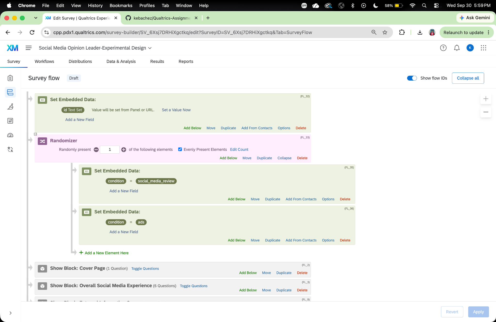
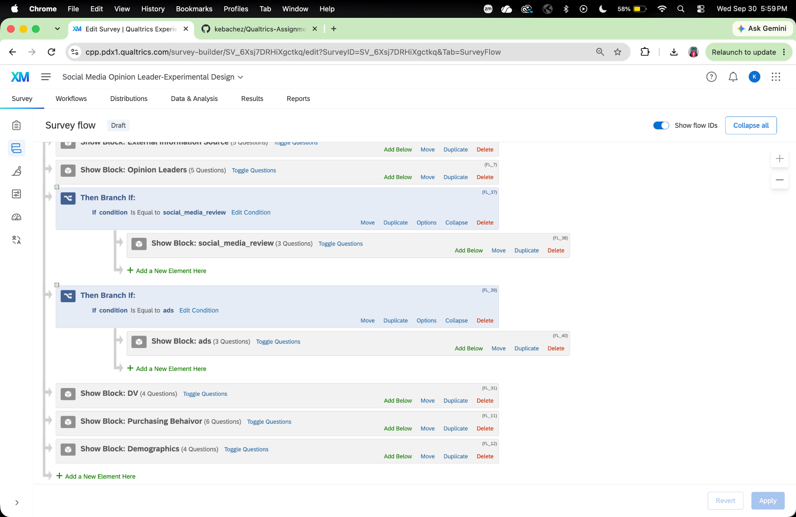
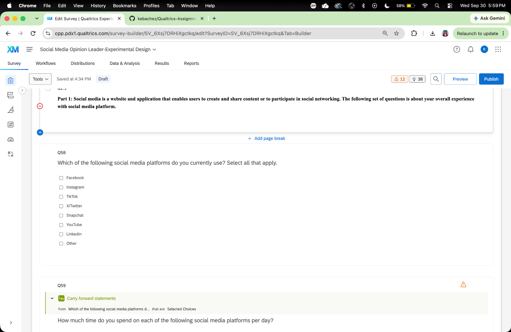
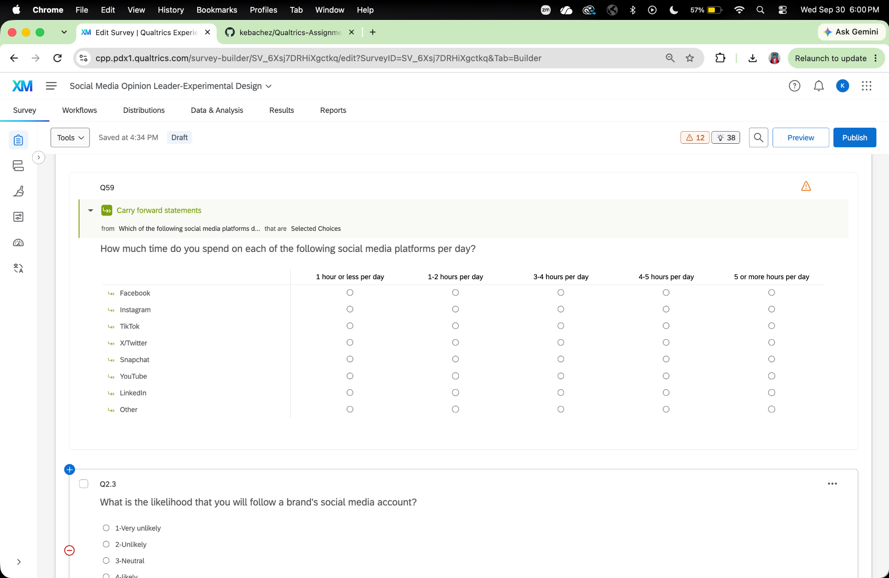
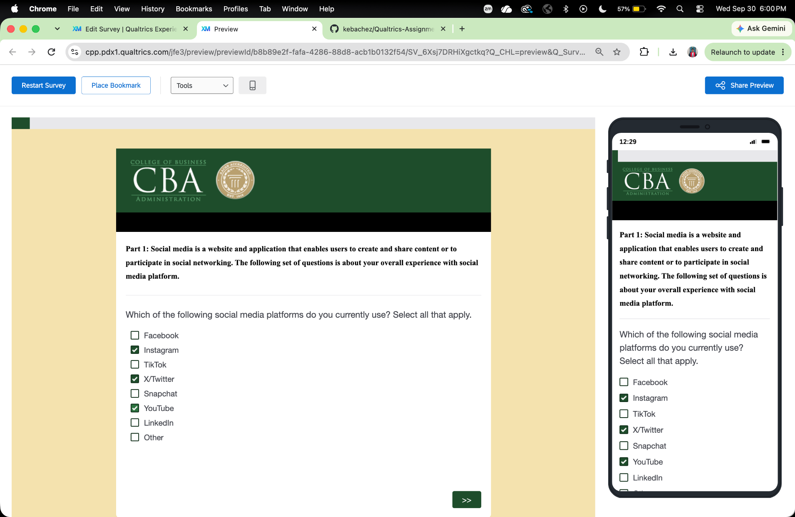
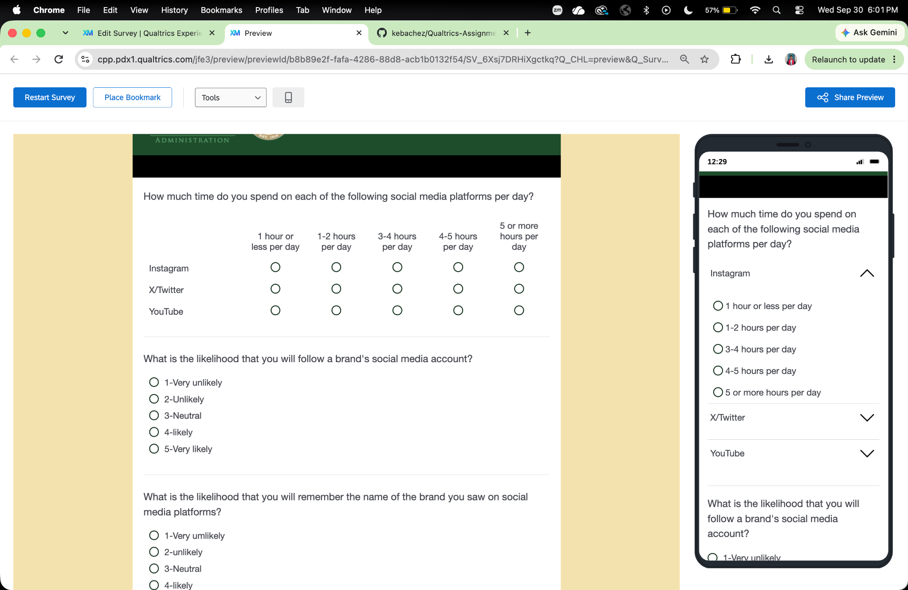
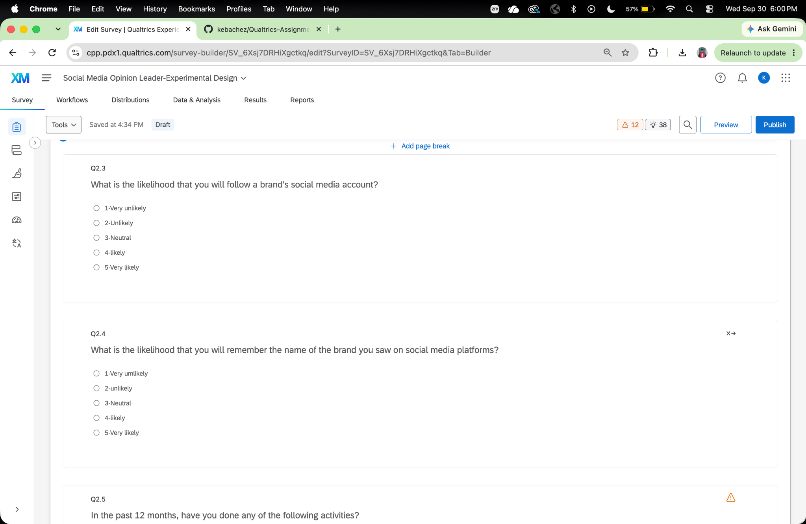
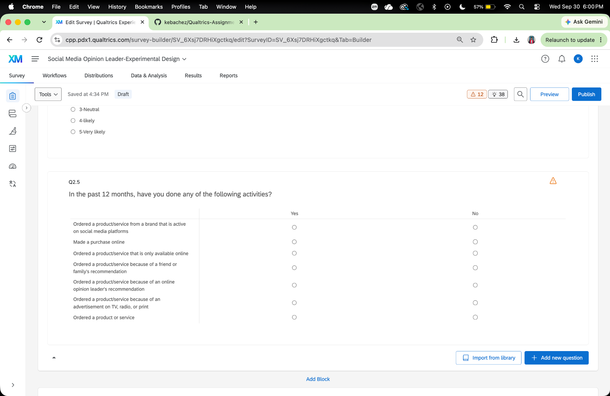
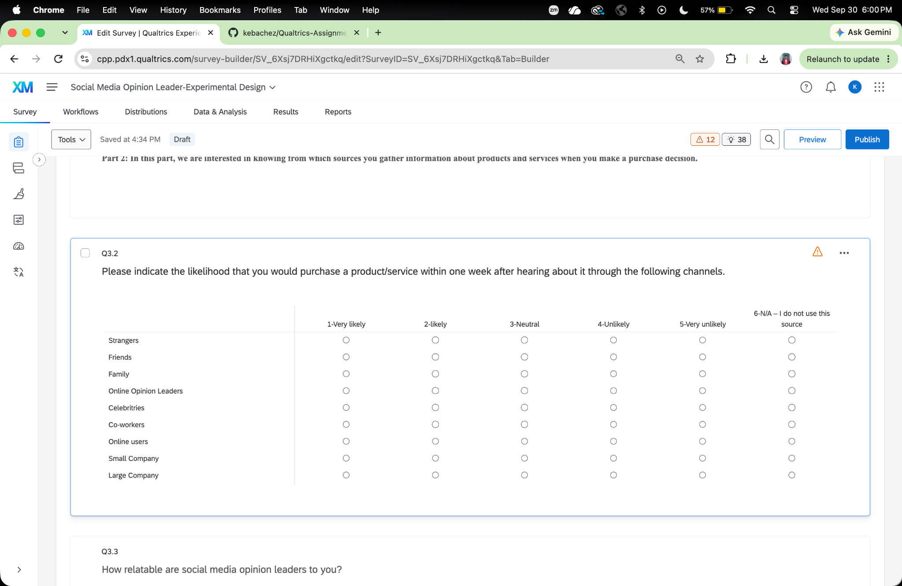

# Qualtrics Assignment 2

## Experimental Design and Random Assignment

### Randomizer Setup

Participants were randomly assigned to one of two experimental conditions using the Qualtrics Randomizer. The Randomizer was set to randomly present one of the following conditions, with the "Evenly Present Elements" option enabled:

- social_media_review
- ads

### Branch Logic

Branch logic was used to ensure that participants only viewed the advertisement condition to which they were randomly assigned.

Participants assigned to the social media review condition viewed the `social_media_review` block, while participants assigned to the advertisement condition viewed the `ads` block.

After viewing one of the two conditions, all participants continued to the same dependent variable questions.

### Survey Flow

The complete Survey Flow was reviewed to confirm that the Randomizer, branches, experimental conditions, and remaining survey blocks were placed in the appropriate order.

## Improvement of Social Media Usage Measurement

### Multiple-Selection Social Media Question

The original Q2.2 measured overall social media usage but did not identify how much time respondents spent on each individual platform.

A new multiple-selection question was created asking respondents to select all social media platforms they currently use.

### Carry Forward Setup

A Matrix Table question was created to measure the amount of time respondents spend on each social media platform per day.

The Carry Forward Statements function was used so that only the social media platforms selected in the previous question would appear in the Matrix Table.

### Carry Forward Preview Test

The survey was previewed to confirm that the Carry Forward function worked correctly.

In the preview, Instagram, X/Twitter, and YouTube were selected.

Only those selected platforms appeared in the follow-up time usage question.

## Additional Questionnaire Improvements

### Improvement 1: Consistent Response Scale Direction

The original response scales for Q2.3 and Q2.4 were ordered from "Very likely" to "Very unlikely."

The response scale was revised to:

1. Very unlikely
2. Unlikely
3. Neutral
4. Likely
5. Very likely

This creates a more consistent and intuitive response order and can reduce respondent confusion.

### Improvement 2: Defined Recall Period

Q2.5 originally asked respondents whether they had ever performed certain activities.

The question was revised to:

"In the past 12 months, have you done any of the following activities?"

Adding a defined recall period gives respondents a consistent timeframe and makes responses easier to compare.

### Improvement 3: Not Applicable Response Option

Q3.2 originally required respondents to provide a likelihood rating for every information source.

A new response option was added:

"6 - N/A - I do not use this source"

This allows respondents who do not use a particular source to provide an accurate response rather than being forced to select a likelihood rating.

# Appendix

## Published HTML Report

[Published HTML Report](PASTE-YOUR-GITHUB-PAGES-LINK-HERE)

## GitHub Repository

[GitHub Repository](<https://github.com/kebachez/Qualtrics-Assignment-2---Experimental-Design.git>)